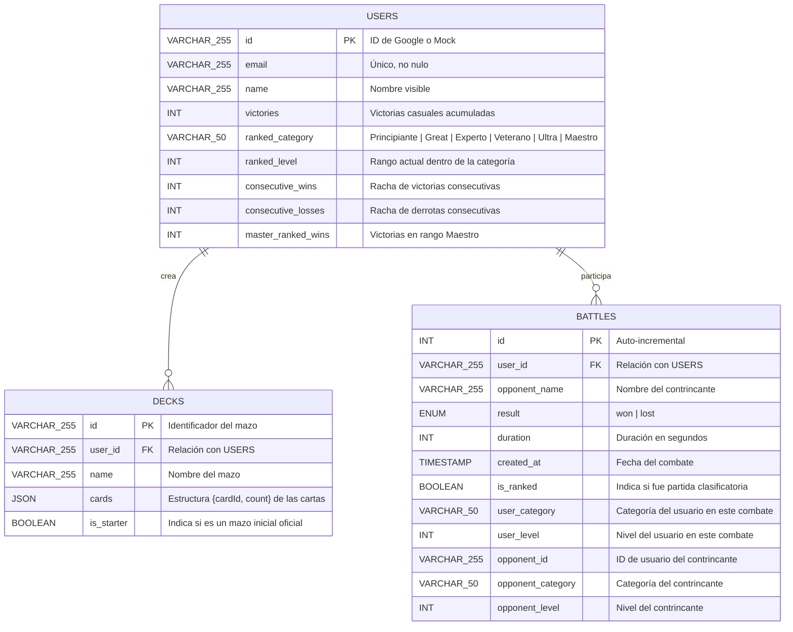

# Pokémon TCG: Duel Arena (Vanilla JS & Node.js)

¡Bienvenido a **Pokémon TCG: Duel Arena**! Esta aplicación es un simulador multijugador en tiempo real para disputar partidas del Juego de Cartas Coleccionables de Pokémon (JCC), enfocado en la fidelidad visual y en proveer una experiencia de juego flexible mediante reglas automatizadas e interacciones estilo simulador de mesa (Sandbox).

El proyecto está construido enteramente sobre tecnologías web estándar (HTML5, Vanilla CSS y Vanilla JS en el frontend) y cuenta con un servidor backend en **Node.js** con soporte para persistencia en **MySQL** y sincronización en tiempo real mediante **WebSockets**.

---

## Índice
1. [Características Principales](#1-características-principales)
2. [Estructura del Proyecto](#2-estructura-del-proyecto)
3. [Diseño y Estructura de la Base de Datos](#3-diseño-y-estructura-de-la-base-de-datos)
4. [Ciclo de las Partidas y Emparejamiento (Matchmaking)](#4-ciclo-de-las-partidas-y-emparejamiento-matchmaking)
5. [Sistema Competitivo (Liga Ranked)](#5-sistema-competitivo-liga-ranked)
6. [Automatización de Reglas y Modo Sandbox](#6-automatización-de-reglas-y-modo-sandbox)
7. [Instalación y Configuración](#7-instalación-y-configuración)
8. [Scripts de Utilidad para la Base de Datos](#8-scripts-de-utilidad-para-la-base-de-datos)

---

## 1. Características Principales

*   **Autenticación Flexible:** Inicio de sesión seguro con Google Sign-In (OAuth2) o mediante un inicio de sesión simulado (Mock Login) que agiliza el desarrollo y pruebas locales.
*   **Editor de Mazos (Deck Builder):** Interfaz completa para crear y editar mazos de 60 cartas buscando en la base de datos de cartas cargada. Se incluyen cajas de mazos visuales.
*   **Cola de Emparejamiento Casual y Ranked:** Sistemas independientes para buscar partidas multijugador. La cola competitiva empareja exclusivamente a jugadores de la misma categoría de liga.
*   **Salas Privadas con Contraseña:** Posibilidad de crear salas personalizadas en las que se genera un ID único de 6 dígitos y una contraseña opcional para invitar amigos. Estas partidas están exentas del registro de estadísticas y victorias globales.
*   **Tablero de Duelo Interactivo:** Tablero dinámico con soporte visual para cartas activas, banca (máximo 5 slots), cartas de premio, baraja, pila de descarte, mano del jugador, contadores de daño y estados especiales (Dormido, Paralizado, Envenenado, Quemado).
*   **Modo Sandbox Multijugador:** Acciones manuales libres para mover cartas de una zona a otra, robar, lanzar monedas y cambiar daños, permitiendo a los jugadores autogestionar el duelo y corregir cualquier situación imprevista.
*   **Estadísticas e Historial Divididos:** Tabla de clasificación global (Leaderboard) e historial de batallas discriminados en pestañas independientes para los modos Normal (Casual) y Ranked (Competitivo). El panel de perfil se adapta dinámicamente con imágenes de trofeos y rangos.

---

## 2. Estructura del Proyecto

*   `/cards`: Archivos JSON con los datos de las cartas organizadas por sets (ej. Base Set).
*   `/Sets`: Catálogo principal de expansiones (ej. `en.json`) e imágenes de trofeos para las categorías de liga.
*   `/Reglas`: Manuales oficiales en PDF y texto plano.
*   `/Ejemplos`: Capturas de pantalla e imágenes de referencia del tablero y el editor.
*   `/Reportes`: Informes de diseño de emparejamiento, cumplimiento de reglas y análisis de microservicios.
*   `/server`:
    *   `db.js`: Conectividad MySQL, queries generales y utilidades de usuario/mazo/combates.
    *   `cardLoader.js`: Carga en memoria del JSON de cartas de los sets soportados.
    *   `gameState.js`: Motor y lógica del estado de juego (ServerGameState).
    *   `effectEngine.js`: Procesamiento automático de los efectos de los ataques y cartas de entrenador.
*   `server.js`: Punto de entrada del servidor HTTP y del servidor WebSocket.
*   `index.html` e `index.css`: Interfaz visual y estilos premium del frontend.
*   `js/`: Scripts JavaScript del frontend (lógica de red, UI, renderizado de cartas y tablero).

---

## 3. Diseño y Estructura de la Base de Datos

La base de datos MySQL se estructura en torno a tres tablas principales. Las relaciones están protegidas mediante restricciones de clave foránea con eliminación en cascada (`ON DELETE CASCADE`), garantizando la integridad de los datos.



### Detalle de las Tablas:
1.  **`users`**: Almacena las cuentas de usuario creadas al autenticarse. Lleva el control de las victorias casuales en `victories` y la información competitiva del sistema ranked (`ranked_category`, `ranked_level`, etc.).
2.  **`decks`**: Guarda los mazos de los usuarios. El campo `cards` es una cadena JSON que lista las IDs de las cartas y la cantidad de copias de cada una. Se distingue a los mazos iniciales con la bandera `is_starter` para evitar su borrado accidental.
3.  **`battles`**: Registro histórico de partidas jugadas. Guarda el resultado de cada jugador (si ganó o perdió), la duración de la partida, la fecha y si la partida fue casual o ranked.

---

## 4. Ciclo de las Partidas y Emparejamiento (Matchmaking)

Las interacciones estáticas (autenticación, estadísticas, guardado de mazos) viajan mediante **HTTP REST/JSON**. El desarrollo del combate ocurre en su totalidad a través de **WebSockets**.

### Flujo del Matchmaking y de la Sala:

1.  **Conexión inicial:** El cliente se conecta a `/ws?token=SESION_TOKEN`. El servidor valida el token contra su mapa en memoria de sesiones activas. Si es válido, asocia el socket a la sesión del jugador.
2.  **Entrada en Cola (`JOIN_QUEUE` o `JOIN_RANKED_QUEUE`):** El cliente envía un mensaje JSON especificando el mazo seleccionado. El servidor verifica en la BD que el mazo pertenezca al usuario antes de ingresarlo a la cola `QUEUE` (casual) o `RANKED_QUEUE` (competitivo).
3.  **Algoritmo de Emparejamiento:** El servidor ejecuta `tryMatchmaking()` o `tryRankedMatchmaking()`. En la cola casual, busca dos jugadores disponibles que no tengan el mismo ID. En la cola competitiva, además de validar que sean distintas cuentas, restringe el emparejamiento para que ambos pertenezcan a la **misma categoría competitiva** (independientemente del nivel).
4.  **Aislamiento en Sala:** Al emparejarlos, se crea una sala virtual en el servidor identificada por un `matchId` aleatorio y se añade al mapa de partidas activas `MATCHES`. Ambas conexiones WebSocket guardan el identificador `ws.currentMatchId`.
5.  **Carga Segura de Estado:** El servidor carga y mezcla los mazos desde la base de datos aplicando la mezcla de Fisher-Yates, decide quién inicia lanzando una moneda y envía a cada cliente el mensaje `MATCH_START`.
6.  **Desconexión y Forfeit (Limpieza Concurrente):** Si un jugador se desconecta, el servidor procesa un abandono automático. La limpieza de `MATCHES` y sockets se ejecuta de forma sincrónica al inicio de `resolveMatchEnd()` para impedir registros duplicados de victorias simultáneas.

---

## 5. Sistema Competitivo (Liga Ranked)

El modo clasificatorio permite a los entrenadores ascender a través de ligas mediante un sistema de trofeos y niveles:

*   **Categorías y Niveles**:
    - **Principiante**: Niveles 1 a 3 (3 victorias por nivel. Límite de derrotas consecutivas para descender: 3).
    - **Great**: Niveles 1 a 4 (4 victorias por nivel. Límite de derrotas: 4).
    - **Experto**: Niveles 1 a 5 (5 victorias por nivel. Límite de derrotas: 5).
    - **Veterano**: Niveles 1 a 5 (5 victorias por nivel. Límite de derrotas: 5).
    - **Ultra**: Niveles 1 a 5 (5 victorias por nivel. Límite de derrotas: 5).
    - **Maestro**: Rango supremo sin niveles. Los jugadores se ordenan descendente e históricamente por victorias ranked totales en este rango (`master_ranked_wins`). Límite de derrotas: 10.
*   **Descenso**: Si se alcanza el límite de derrotas consecutivas de la categoría actual, el jugador baja un nivel. Si se encuentra en nivel 1, desciende de categoría (los jugadores en Principiante 1 no pueden descender más). Al bajar del rango Maestro por racha de derrotas, el jugador cae a Ultra 5.
*   **Trophy Assets**: Se cargan visualmente desde `/Sets/Trofeos` usando las imágenes oficiales asignadas a cada categoría de liga.

---

## 6. Automatización de Reglas y Modo Sandbox

El motor de juego del servidor (`gameState.js`) actúa como árbitro, automatizando varias reglas esenciales del TCG, mientras que delega otras al control humano de mesa mediante el **Modo Sandbox**.

### Reglas Automatizadas:
*   **Configuración (Setup):** Robar 7 cartas iniciales y colocar 6 cartas de premio. Exige la colocación de un Pokémon activo inicial para comenzar.
*   **Energías:** Restringe la unión de energía a un máximo de 1 carta por turno del jugador.
*   **Evolución:** Valida que el Pokémon no evolucione en el mismo turno en el que se puso en juego.
*   **Retirada:** Descuenta los costos de energía correctos de la carta activa al retirarla a la banca, y limita el retiro a un máximo de 1 vez por turno.
*   **Condiciones Especiales en Fin de Turno:** Aplica 10 de daño por Envenenado, 20 de daño por Quemado (y tira moneda con 50% de cura), cura el Sueño con 50% de probabilidad y limpia la Parálisis de forma automática.
*   **Turnos y Condiciones de Victoria:** Controla las fases de turno, calcula el daño de ataques aplicando debilidad/resistencia, procesa fuera de combate (Knockouts) tomando premios, y verifica las condiciones de victoria.

### Modo Sandbox (Acciones `MANUAL_`):
Si un jugador necesita resolver dinámicas de juego más complejas o discrepancias no cubiertas por la lógica del servidor, el juego permite enviar acciones manuales. Esto incluye:
*   `MANUAL_DRAW`: Robar cartas a voluntad.
*   `MANUAL_DAMAGE_CHANGE`: Incrementar o decrementar contadores de daño en cualquier Pokémon.
*   `MANUAL_CARD_MOVEMENT`: Mover libremente una carta entre zonas (mano, banca, activo, descarte, baraja, premios).
*   `MANUAL_FLIP_COIN`: Lanzar monedas arbitrariamente.

---

## 7. Instalación y Configuración

### Requisitos Previos:
*   **Node.js** (versión 16 o superior).
*   **MySQL Server** en ejecución.

### Pasos para Configurar (Instalación Local):

1.  Clona o descarga el repositorio en tu espacio de trabajo.
2.  Instala las dependencias de Node.js:
    ```bash
    npm install
    ```
3.  Configura las variables de entorno. Puedes editar o crear el archivo `.env` en la raíz del proyecto para definir los datos de conexión a MySQL y la ID de autenticación de Google (si se utiliza):
    ```env
    PORT=3000
    GOOGLE_CLIENT_ID=TU_CLIENT_ID_DE_GOOGLE
    
    # Datos de Conexión a Base de Datos
    DB_HOST=localhost
    DB_USER=root
    DB_PASSWORD=R00tMySQL
    DB_NAME=pkmn_cards_db
    ```
4.  Inicia el servidor de desarrollo:
    ```bash
    npm run dev
    ```

### Instalación con Docker:

La aplicación viene preparada con configuración multi-contenedor mediante Docker Compose.

1.  Asegúrate de tener en ejecución **Docker Desktop**.
2.  Configura tu archivo `.env` ajustando los valores del host. Si ejecutas Docker Compose, la base de datos se expone en el host `mysql`.
3.  Levanta los servicios desde la raíz del proyecto:
    ```bash
    docker compose up --build -d
    ```
    *Esto levantará tres contenedores: frontend (Nginx en puerto 80), backend (NodeJS en puerto 3000) y mysql (MySQL en puerto 3306).*
4.  Ejecuta la migración de base de datos inicial dentro del contenedor de NodeJS:
    ```bash
    docker compose exec backend npm run db:setup
    ```
5.  Accede a la aplicación a través de `http://localhost`.

---

## 8. Scripts de Utilidad para la Base de Datos

Hemos integrado dos scripts de Node.js para facilitar la administración y el reinicio de la base de datos durante el desarrollo o la puesta a punto:

### 1. Instalación Completa (Desde Cero)
Para inicializar por primera vez la base de datos o restaurarla completamente, ejecuta:
```bash
npm run db:setup
```
*   **¿Qué hace?** Conecta a tu servidor MySQL, destruye la base de datos completa configurada en el `.env` si ya existiera, la crea limpia y genera desde cero las tablas `users`, `decks` y `battles` con todas las columnas casuales y competitivas.

### 2. Reinicio de Datos (Limpieza Conservadora)
Si deseas limpiar el servidor borrando únicamente el historial de duelos y los mazos guardados, pero conservando los perfiles de usuario creados, ejecuta:
```bash
npm run db:reset
```
*   **¿Qué hace?**
    1.  Elimina todos los registros de combates de la tabla `battles`.
    2.  Elimina todos los mazos personalizados de la tabla `decks`.
    3.  Restablece a `0` el contador de victorias (`victories`) de todos los usuarios registrados en `users`.
    4.  Reinicia todas las métricas competitivas a su estado base (categoría 'Principiante' y nivel 1).
    5.  Vuelve a sembrar de forma automática los mazos iniciales oficiales (`STARTER_DECKS`) para cada uno de los usuarios que ya existían en el sistema.
