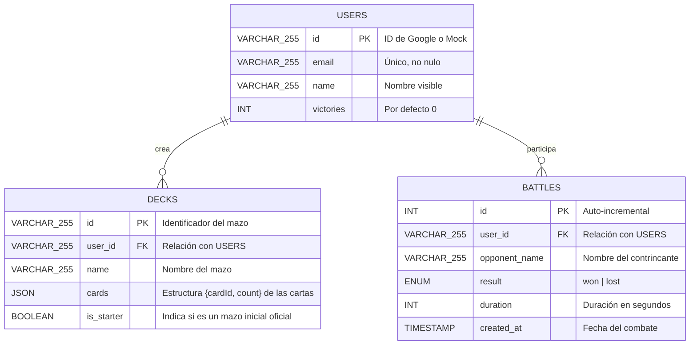

# Pokémon TCG: Duel Arena (Vanilla JS & Node.js)

¡Bienvenido a **Pokémon TCG: Duel Arena**! Esta aplicación es un simulador multijugador en tiempo real para disputar partidas del Juego de Cartas Coleccionables de Pokémon (JCC), enfocado en la fidelidad visual y en proveer una experiencia de juego flexible mediante reglas automatizadas e interacciones estilo simulador de mesa (Sandbox).

El proyecto está construido enteramente sobre tecnologías web estándar (HTML5, Vanilla CSS y Vanilla JS en el frontend) y cuenta con un servidor backend en **Node.js** con soporte para persistencia en **MySQL** y sincronización en tiempo real mediante **WebSockets**.

---

## Índice
1. [Características Principales](#1-características-principales)
2. [Estructura del Proyecto](#2-estructura-del-proyecto)
3. [Diseño y Estructura de la Base de Datos](#3-diseño-y-estructura-de-la-base-de-datos)
4. [Ciclo de las Partidas y Emparejamiento (Matchmaking)](#4-ciclo-de-las-partidas-y-emparejamiento-matchmaking)
5. [Automatización de Reglas y Modo Sandbox](#5-automatización-de-reglas-y-modo-sandbox)
6. [Instalación y Configuración](#6-instalación-y-configuración)
7. [Scripts de Utilidad para la Base de Datos](#7-scripts-de-utilidad-para-la-base-de-datos)

---

## 1. Características Principales

*   **Autenticación Flexible:** Inicio de sesión seguro con Google Sign-In (OAuth2) o mediante un inicio de sesión simulado (Mock Login) que agiliza el desarrollo y pruebas locales.
*   **Editor de Mazos (Deck Builder):** Interfaz completa para crear y editar mazos de 60 cartas buscando en la base de datos de cartas cargada. Se incluyen cajas de mazos visuales.
*   **Cola de Emparejamiento (Matchmaking Queue):** Sistema centralizado para emparejar jugadores de forma automática en salas virtuales aisladas.
*   **Salas Privadas con Contraseña:** Posibilidad de crear salas personalizadas en las que se genera un ID único de 6 dígitos y una contraseña opcional para invitar amigos. Estas partidas están exentas del registro de estadísticas y victorias globales.
*   **Tablero de Duelo Interactivo:** Tablero dinámico con soporte visual para cartas activas, banca (máximo 5 slots), cartas de premio, baraja, pila de descarte, mano del jugador, contadores de daño y estados especiales (Dormido, Paralizado, Envenenado).
*   **Modo Sandbox Multijugador:** Acciones manuales libres para mover cartas de una zona a otra, robar, lanzar monedas y cambiar daños, permitiendo a los jugadores autogestionar el duelo y corregir cualquier situación imprevista.
*   **Estadísticas e Historial:** Tabla de clasificación global (Leaderboard) en tiempo real basada en victorias totales y tasa de juegos, acompañada de un historial detallado de partidas por usuario.

---

## 2. Estructura del Proyecto

*   `/cards`: Archivos JSON con los datos de las cartas organizadas por sets (ej. Base Set).
*   `/Sets`: Catálogo principal de expansiones (ej. `en.json`).
*   `/Reglas`: Manuales oficiales en PDF y texto plano.
*   `/Ejemplos`: Capturas de pantalla e imágenes de referencia del tablero y el editor.
*   `/server`:
    *   `db.js`: Conectividad MySQL, queries generales y utilidades de usuario/mazo/combates.
    *   `cardLoader.js`: Carga en memoria del JSON de cartas de los sets soportados.
    *   `gameState.js`: Motor y lógica del estado de juego (ServerGameState).
    *   `effectEngine.js`: Procesamiento automático de los efectos de los ataques y cartas de entrenador.
*   `server.js`: Punto de entrada del servidor HTTP y del servidor WebSocket.
*   `index.html` e `index.css`: Interfaz visual y estilos premium del frontend.
*   `js/`: Scripts JavaScript del frontend (lógica de red, UI, renderizado de cartas y tablero).

---

## 3. Diseño y Estructura de la Base de Datos

La base de datos MySQL se estructura en torno a tres tablas principales. Las relaciones están protegidas mediante restricciones de clave foránea con eliminación en cascada (`ON DELETE CASCADE`), garantizando la integridad de los datos.



### Detalle de las Tablas:
1.  **`users`**: Almacena las cuentas de usuario creadas al autenticarse. Lleva la cuenta acumulativa de `victories`.
2.  **`decks`**: Guarda los mazos de los usuarios. El campo `cards` es una cadena JSON que lista las IDs de las cartas y la cantidad de copias de cada una. Se distingue a los mazos iniciales con la bandera `is_starter` para evitar su borrado accidental.
3.  **`battles`**: Registro histórico de partidas jugadas. Guarda el resultado de cada jugador (si ganó o perdió), la duración de la partida y la fecha. Sirve para construir el historial de batallas y calcular el total de partidas en el Leaderboard.

---

## 4. Ciclo de las Partidas y Emparejamiento (Matchmaking)

Las interacciones estáticas (autenticación, estadísticas, guardado de mazos) viajan mediante **HTTP REST/JSON**. El desarrollo del combate ocurre en su totalidad a través de **WebSockets**.

### Flujo del Matchmaking y de la Sala:

1.  **Conexión inicial:** El cliente se conecta a `/ws?token=SESION_TOKEN`. El servidor valida el token contra su mapa en memoria de sesiones activas. Si es válido, asocia el socket a la sesión del jugador.
2.  **Entrada en Cola (`JOIN_QUEUE`):** El cliente envía un mensaje JSON especificando el mazo seleccionado. El servidor verifica en la BD que el mazo pertenezca al usuario antes de ingresarlo a la cola global `QUEUE`.
3.  **Algoritmo de Emparejamiento:** El servidor ejecuta `tryMatchmaking()`. Toma al primer jugador en la cola y busca al siguiente disponible que **no tenga su mismo ID de usuario** (evitando emparejamiento con pestañas duplicadas del mismo jugador).
4.  **Aislamiento en Sala:** Al emparejarlos, se crea una sala virtual en el servidor identificada por un `matchId` aleatorio y se añade al mapa de partidas activas `MATCHES`. Ambas conexiones WebSocket guardan el identificador `ws.currentMatchId`.
5.  **Carga Segura de Estado:** El servidor carga y mezcla los mazos desde la base de datos aplicando la mezcla de Fisher-Yates, decide quién inicia lanzando una moneda y envía a cada cliente el mensaje `MATCH_START`. Para evitar hacks de memoria en el cliente, el servidor **sólo envía los datos descifrados que el jugador correspondiente tiene derecho a ver** (su mano/premios, pero ocultando la identidad de la mano/premios del rival).
6.  **Desconexión y Forfeit:** Si un jugador cierra voluntaria o involuntariamente su WebSocket durante la partida, el servidor lo interpreta como un abandono automático y otorga la victoria al oponente.

### Sistema de Salas Privadas:

*   **Creación de Sala (`CREATE_PRIVATE_ROOM`):** Al configurar una sala privada, el cliente envía su mazo y una contraseña opcional. El servidor genera un código numérico aleatorio único de 6 dígitos, registra la sala en memoria (`PRIVATE_ROOMS`) y sitúa al jugador en una pantalla de espera que muestra los datos de la sala. Si el creador cancela la espera o se desconecta de la red, la sala privada es destruida inmediatamente en el servidor.
*   **Unirse a Sala (`JOIN_PRIVATE_ROOM`):** El contrincante ingresa el ID de sala, la contraseña correspondiente y elige su mazo. Si la sala existe, la contraseña es correcta, los jugadores son distintos y el mazo es válido, el servidor crea la partida virtual aislada con la bandera `isPrivate = true` e inicia el combate de forma instantánea. Si hay errores (contraseña incorrecta, ID inexistente, etc.), el sistema notifica al retador mediante un mensaje modal de alerta y aborta la conexión.
*   **Exención de Estadísticas**: Cuando finaliza una partida con `isPrivate = true`, el servidor notifica los resultados normales a ambos clientes, pero **no registra el combate en la base de datos ni incrementa el contador de victorias** de los jugadores, garantizando que los duelos amistosos no influyan en el Leaderboard global.


---

## 5. Automatización de Reglas y Modo Sandbox

El motor de juego del servidor (`gameState.js`) actúa como árbitro, automatizando varias reglas esenciales del TCG, mientras que delega otras al control humano de mesa mediante el **Modo Sandbox**.

### Reglas Automatizadas:
*   **Configuración (Setup):** Robar 7 cartas iniciales y colocar 6 cartas de premio. Exige la colocación de un Pokémon activo inicial para comenzar.
*   **Energías:** Restringe la unión de energía a un máximo de 1 carta por turno del jugador.
*   **Evolución:** Valida que el Pokémon no evolucione en el mismo turno en el que se puso en juego.
*   **Retirada:** Descuenta los costos de energía correctos de la carta activa al retirarla a la banca, y limita el retiro a un máximo de 1 vez por turno.
*   **Turnos y Condiciones de Victoria:** Controla las fases de turno, calcula el daño de ataques aplicando debilidad/resistencia, procesa fuera de combate (Knockouts) tomando premios, y verifica las condiciones de victoria (quedarse sin Pokémon en juego, quedarse sin cartas de premio o Deck Out al inicio del turno rival).

### Modo Sandbox (Acciones `MANUAL_`):
Si un jugador necesita resolver dinámicas de juego más complejas o discrepancias no cubiertas por la lógica del servidor (por ejemplo, el robo adicional por mulligans del oponente, la condición especial de *Quemado*, o la resolución detallada de una victoria simultánea mediante muerte súbita), el juego permite enviar acciones manuales. Esto incluye:
*   `MANUAL_DRAW`: Robar cartas a voluntad.
*   `MANUAL_DAMAGE_CHANGE`: Incrementar o decrementar contadores de daño en cualquier Pokémon.
*   `MANUAL_CARD_MOVEMENT`: Mover libremente una carta entre zonas (mano, banca, activo, descarte, baraja, premios).
*   `MANUAL_FLIP_COIN`: Lanzar monedas arbitrariamente.

---

## 6. Instalación y Configuración

### Requisitos Previos:
*   **Node.js** (versión 16 o superior).
*   **MySQL Server** en ejecución.

### Pasos para Configurar:

1.  Clona o descarga el repositorio en tu espacio de trabajo.
2.  Instala las dependencias de Node.js:
    ```bash
    npm install
    ```
3.  Configura las variables de entorno. Puedes editar o crear el archivo `.env` en la raíz del proyecto para definir los datos de conexión a MySQL y la ID de autenticación de Google (si se utiliza):
    ```env
    PORT=3000
    GOOGLE_CLIENT_ID=TU_CLIENT_ID_DE_GOOGLE
    
    # Opcionales para personalizar la base de datos (con valores por defecto si se omiten)
    DB_HOST=localhost
    DB_USER=root
    DB_PASSWORD=R00tMySQL
    DB_NAME=pkmn_cards_db
    ```
4.  Inicia el servidor de desarrollo:
    ```bash
    npm run dev
    ```

---

## 7. Scripts de Utilidad para la Base de Datos

Hemos integrado dos scripts de Node.js para facilitar la administración y el reinicio de la base de datos durante el desarrollo o la puesta a punto:

### 1. Instalación Completa (Desde Cero)
Para inicializar por primera vez la base de datos o restaurarla completamente, ejecuta:
```bash
npm run db:setup
```
*   **¿Qué hace?** Conecta a tu servidor MySQL, destruye la base de datos completa configurada en el `.env` (o por defecto `pkmn_cards_db`) si ya existiera, la crea limpia y genera desde cero las tablas `users`, `decks` y `battles`.

### 2. Reinicio de Datos (Limpieza Conservadora)
Si deseas limpiar el servidor borrando únicamente el historial de duelos y los mazos guardados, pero conservando los perfiles de usuario creados, ejecuta:
```bash
npm run db:reset
```
*   **¿Qué hace?**
    1.  Elimina todos los registros de combates de la tabla `battles`.
    2.  Elimina todos los mazos personalizados de la tabla `decks`.
    3.  Restablece a `0` el contador de victorias (`victories`) de todos los usuarios registrados en `users`.
    4.  Vuelve a sembrar de forma automática los mazos iniciales oficiales (`STARTER_DECKS`) para cada uno de los usuarios que ya existían en el sistema, asegurando que sus cuentas sigan operativas y listas para jugar inmediatamente.
