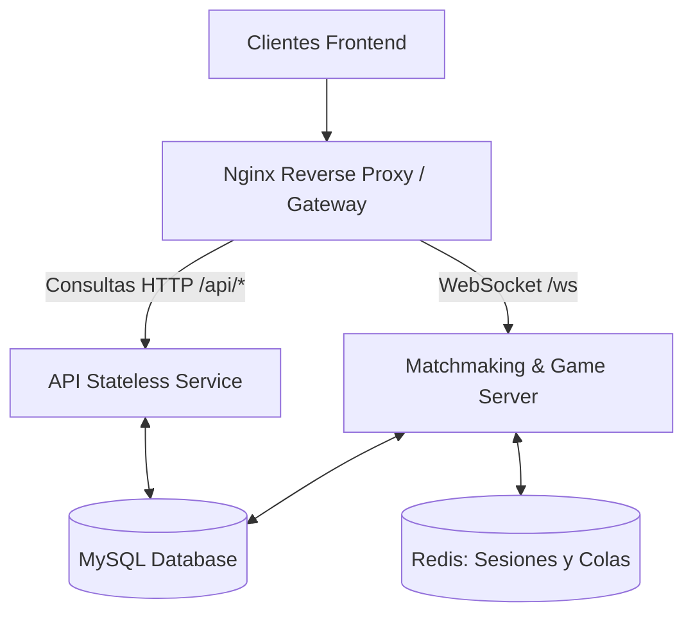

# Análisis de Arquitectura: Microservicios en Docker

Este análisis evalúa la viabilidad y necesidad de dividir el backend monolítico actual en microservicios independientes para los diferentes componentes del juego (Matchmaking, Combates, Consultas de Leaderboard, Estadísticas e Historial).

---

## 1. Arquitectura Actual (Monolito)

El backend actual está empaquetado en un único servidor Node.js (`server.js`) que maneja:
- **HTTP APIs**: Consultas de base de datos para perfiles, mazos, historiales y clasificaciones.
- **WebSockets (WS)**: Gestión de colas de emparejamiento (`QUEUE` y `RANKED_QUEUE`), emparejamiento de rivales y la simulación del estado de combate activo (`ServerGameState`) en memoria RAM.
- **Base de Datos**: Conexión a un único contenedor MySQL.

En el archivo `docker-compose.yml` provisto, este monolito se despliega de manera simple y directa, lo que facilita el desarrollo local en Windows con WSL2.

---

## 2. Análisis del Desglose en Microservicios

A continuación se detalla cómo impactaría la separación de los servicios según el tipo de tráfico:

### A. Servicios de Consulta y Lectura (Leaderboards, KPIs, Historial, Top 3)
Estas operaciones son puramente sin estado (stateless) y realizan consultas de solo lectura a MySQL:
- **Leaderboard clásico y ranked** (`/api/leaderboard`, `/api/ranked/leaderboard`)
- **Estadísticas de KPI y resúmenes** (`/api/ranked/stats`, `/api/server-status`)
- **Historial de combates recientes** (`/api/history`, `/api/recent-battles`)

> [!TIP]
> **Evaluación**: Separar estas consultas en un servicio web HTTP stateless es muy factible. Permite escalar horizontalmente las consultas de lectura agregando múltiples réplicas detrás de Nginx sin afectar las conexiones WebSocket de juego.

### B. Servicios de Combate y Colas (Casual / Ranked)
El emparejamiento y la simulación de juego son operaciones con estado (stateful):
- Las colas (`QUEUE` y `RANKED_QUEUE`) residen en arrays de memoria RAM.
- Los duelos en curso (`MATCHES` map) contienen las instancias vivas de `ServerGameState`.

> [!WARNING]
> **El Reto del Estado en Memoria**:
> Si separamos los combates normales y ranked en microservicios diferentes, o si escalamos a más de 1 contenedor de juego:
> 1. Dos jugadores en contenedores de docker distintos no se emparejarán porque sus colas de espera residen en la memoria RAM local de cada contenedor.
> 2. Se requeriría un coordinador centralizado de colas (como Redis Pub/Sub o base de datos) para unir a los jugadores.
> 3. Las sesiones de autenticación (`SESSIONS` map) ya no podrían ser locales en memoria, requiriendo un almacén central de sesiones (como Redis) para verificar tokens.

---

## 3. Matriz de Decisiones Arquitectónicas

| Criterio | Arquitectura Monolítica (Recomendada) | Arquitectura de Microservicios |
| :--- | :--- | :--- |
| **Complejidad del Código** | **Baja**. Todo el flujo corre sobre la misma base de datos y memoria. | **Alta**. Requiere reescribir colas para usar Redis/DB y gestionar estados distribuidos. |
| **Infraestructura Docker** | **Simple**. 1 contenedor App + 1 MySQL. | **Compleja**. Múltiples contenedores App, MySQL, Redis para sesiones/colas, y configuración de red interna avanzada. |
| **Uso de Recursos** | **Muy eficiente** para uso de bajo a mediano (hasta ~5,000 jugadores concurrentes). | **Alto**. Mayor overhead por procesos individuales y comunicaciones de red inter-servicio. |
| **Despliegue y Debugging** | **Sencillo**. Fácil seguimiento de logs unificados. | **Difícil**. Requiere rastreo de peticiones distribuidas y sincronización de estados. |

---

## 4. Conclusión y Recomendación

> [!IMPORTANT]
> **Recomendación**: **No es necesario ni recomendable dividir la aplicación en microservicios independientes en este momento.**
> El volumen actual de jugadores y la escala del proyecto se benefician enormemente de la simplicidad y el rendimiento de la arquitectura monolítica. Dividir el sistema ahora añadiría un overhead de desarrollo considerable (integración de Redis para colas y sesiones compartidas, locks de base de datos) sin ofrecer ventajas reales de rendimiento.

---

## 5. Plan de Implementación de Microservicios (Si se aprueba)

Si de todas formas deseas proceder con la separación de microservicios para Docker, este sería el plan de trabajo necesario:

### Fase 1: Integración de Redis (Persistencia de Sesión y Colas)
1. Instalar y configurar un contenedor de Redis en `docker-compose.yml`.
2. Modificar la autenticación para persistir sesiones en Redis en lugar de `SESSIONS` Map.
3. Modificar las colas `QUEUE` y `RANKED_QUEUE` para que operen sobre Redis (Sorted Sets/Lists) para permitir escalabilidad horizontal.

### Fase 2: Separación de Código en Dockerfiles
1. Crear un servicio `api-server` encargado solo de las rutas `/api/*`.
2. Crear un servicio `game-server` encargado solo de la conexión `/ws` de WebSockets y la simulación del estado de juego.
3. Actualizar la configuración de Nginx (`nginx.conf`) para enrutar las llamadas a los contenedores correspondientes de manera transparente.
