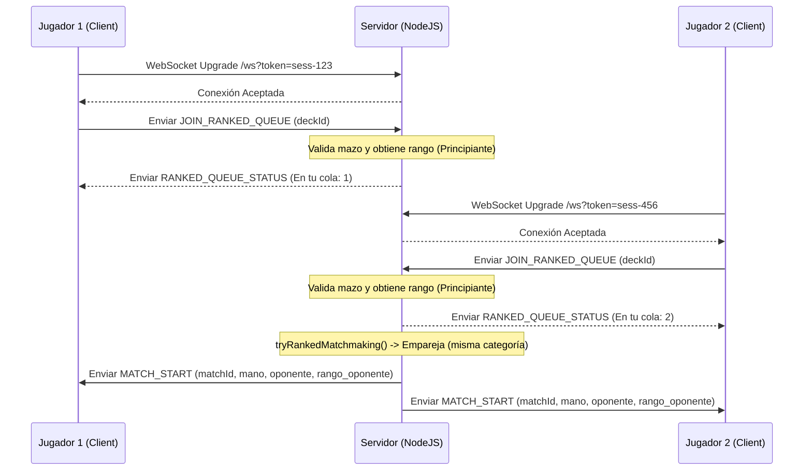

# Informe: Arquitectura Cliente-Servidor y Sistema de Emparejamiento (Matchmaking)

Este informe detalla el funcionamiento del modelo cliente-servidor del juego, explicando el ciclo de vida de las conexiones de red, el flujo de los dos tipos de emparejamiento (Casual y Competitivo), la gestión de salas de juego aisladas en el servidor y la resolución robusta de fin de partida.

---

## 1. Modelo Cliente-Servidor e Interacción en Red
El juego utiliza un modelo híbrido basado en **HTTP/REST** para acciones tradicionales (como autenticación, guardado y eliminación de mazos, consulta de clasificaciones e historial de batallas) y **WebSockets (WS)** para la comunicación en tiempo real durante la búsqueda de partidas y el desarrollo de los duelos.

### Ciclo de vida de la conexión en red:
1. **Conexión WebSocket Inicial (`server.js`):**
   - El cliente realiza una solicitud de actualización (Upgrade) HTTP a WebSocket apuntando a la ruta `/ws?token=SESSION_TOKEN`.
   - El servidor intercepta esta solicitud, extrae el parámetro `token`, y verifica si existe una sesión válida en el mapa en memoria `SESSIONS`.
   - Si no hay una sesión activa con ese token, el servidor rechaza la conexión con una respuesta HTTP `401 Unauthorized`.
   - Si la sesión es válida, el WebSocket se promueve exitosamente y se asocia la identidad del jugador (ID y nombre) al socket.

2. **Manejo de Mensajes Bidireccionales:**
   - La comunicación se basa en el envío de mensajes serializados en formato JSON con la estructura `{ type: 'EVENTO', payload: { ... } }`.
   - El servidor escucha eventos tales como `JOIN_QUEUE`, `JOIN_RANKED_QUEUE`, `LEAVE_QUEUE`, `LEAVE_RANKED_QUEUE`, `SEND_CHAT`, `GAME_ACTION` y `GAME_OVER`.

---

## 2. El Algoritmo de Emparejamiento (Casual y Ranked)

El servidor implementa dos colas de emparejamiento independientes gestionadas mediante arrays globales en memoria:



### A. Cola de Emparejamiento Casual (`QUEUE`)
- **Funcionamiento (`tryMatchmaking()`):**
  - Requiere un mínimo de 2 jugadores.
  - Selecciona al primer jugador de la cola y busca a un oponente que tenga un **ID de usuario diferente** (evitando emparejamiento con pestañas duplicadas del mismo jugador).
  - Al emparejarlos, los remueve de la cola y genera la sala virtual.

### B. Cola de Emparejamiento Competitivo (`RANKED_QUEUE`)
- **Funcionamiento (`tryRankedMatchmaking()`):**
  - Requiere un mínimo de 2 jugadores.
  - Al ingresar a la cola, el servidor recupera la categoría competitiva del usuario (`ranked_category`) de la base de datos y la adjunta al objeto de cola.
  - El emparejamiento busca un oponente que cumpla **dos restricciones**:
    1. Tener un ID de usuario diferente.
    2. Pertenecer a la **misma categoría competitiva** (`ranked_category`).
  - Esto garantiza que un jugador de rango *Principiante* nunca sea emparejado contra un jugador de rango *Great* o *Maestro*, manteniendo la equidad competitiva.

---

## 3. Creación de Salas Aisladas (Match Rooms)
Una vez emparejados dos jugadores, el servidor los aísla en su propia sala virtual independiente:

1. **Identificación Única (`matchId`):**
   - El servidor genera un identificador de partida único utilizando criptografía aleatoria segura: `match-${crypto.randomBytes(8).toString('hex')}` (ej. `match-8f3a9e2c1d5b7a60`).

2. **Carga y Preparación del Estado de Juego:**
   - El servidor carga la lista de cartas de los mazos de ambos jugadores desde la base de datos, los mezcla usando Fisher-Yates, y decide el turno inicial lanzando una moneda.
   - Instancia un nuevo objeto **`ServerGameState`** dedicado a esa partida.

3. **Registro en el Mapa Global `MATCHES`:**
   - Añade la partida al mapa global en memoria `MATCHES.set(matchId, match)` y asocia `ws.currentMatchId = matchId` en las conexiones de ambos jugadores.

4. **Notificación de Inicio (`MATCH_START`):**
   - Se envía un mensaje `MATCH_START` a ambos clientes. Para partidas competitivas (`isRanked = true`), este mensaje incluye el rango del oponente (categoría, nivel, racha de victorias) para que el cliente renderice el banner superior informativo de 10 segundos.

---

## 4. Gestión Concurrente del Cierre de Partidas

### El Problema del Doble Ganador
Anteriormente, cuando un jugador se rendía o finalizaba la partida, el servidor ejecutaba el cierre de forma asíncrona. Durante los tiempos de espera (`await`) de las escrituras en la base de datos para guardar el historial y actualizar estadísticas, si el otro jugador se desconectaba, el manejador de WebSocket `ws.on('close')` se activaba para ese jugador secundario. 

Al ver que la partida todavía existía en el mapa `MATCHES` y que `ws.currentMatchId` seguía activo, el manejador ejecutaba `resolveMatchEnd()` por segunda vez. Esto producía que la primera ejecución resolviera al Jugador A como ganador y la segunda al Jugador B como ganador, guardando datos duplicados y actualizando rachas de forma errónea (otorgando victorias y puntos competitivos a ambos).

### La Solución de Limpieza Sincrónica
Para evitar esta condición de carrera por desconexiones simultáneas al finalizar el duelo, el servidor ahora limpia los estados de forma **sincrónica** al principio de la rutina de cierre:

```javascript
async function resolveMatchEnd(matchId, winnerId, reason, duration) {
  const match = MATCHES.get(matchId);
  if (!match) return; // Si ya fue resuelta por otra llamada simultánea, sale inmediatamente

  const p1 = match.player1;
  const p2 = match.player2;

  // Limpieza sincrónica inmediata
  MATCHES.delete(matchId);
  if (p1.ws) p1.ws.currentMatchId = null;
  if (p2.ws) p2.ws.currentMatchId = null;

  // A partir de aquí, las consultas de base de datos asíncronas son seguras.
  // Cualquier llamada simultánea a resolveMatchEnd o evento 'close' retornará temprano.
  ...
```

Esta mejora en la arquitectura asíncrona de WebSockets garantiza la integridad transaccional del sistema clasificatorio y evita exploits de desconexión.
