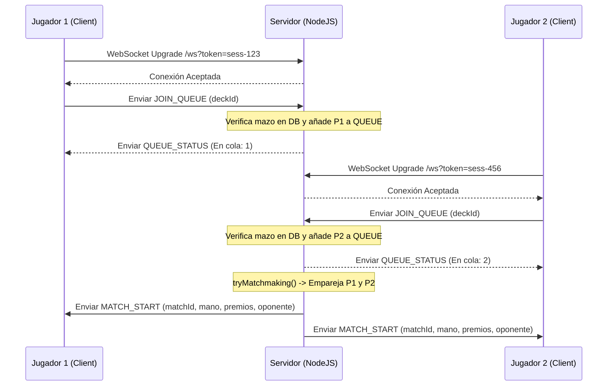

# Informe: Arquitectura Cliente-Servidor y Sistema de Emparejamiento (Matchmaking)

Este informe detalla el funcionamiento del modelo cliente-servidor del juego, explicando el ciclo de vida de las conexiones de red, el flujo del emparejamiento cuando hay múltiples jugadores en cola, y la gestión de salas de juego aisladas en el servidor.

---

## 1. Modelo Cliente-Servidor e Interacción en Red
El juego utiliza un modelo híbrido basado en **HTTP/REST** para acciones tradicionales (como autenticación, guardado y eliminación de mazos, consulta de clasificaciones e historial de batallas) y **WebSockets (WS)** para la comunicación en tiempo real durante la búsqueda de partidas y el desarrollo de los duelos.

### Ciclo de vida de la conexión en red:
1. **Conexión WebSocket Inicial (`server.js` L692-717):**
   - El cliente realiza una solicitud de actualización (Upgrade) HTTP a WebSocket apuntando a la ruta `/ws?token=SESSION_TOKEN`.
   - El servidor intercepta esta solicitud, extrae el parámetro `token`, y verifica si existe una sesión válida en el mapa en memoria `SESSIONS`.
   - Si no hay una sesión activa con ese token, el servidor rechaza la conexión con una respuesta HTTP `401 Unauthorized`.
   - Si la sesión es válida, el WebSocket se promueve exitosamente y se asocia la identidad del jugador (ID y nombre) al socket.

2. **Manejo de Mensajes Bidireccionales:**
   - La comunicación se basa en el envío de mensajes serializados en formato JSON con la estructura `{ type: 'EVENTO', payload: { ... } }`.
   - El servidor escucha eventos tales como `JOIN_QUEUE`, `LEAVE_QUEUE`, `SEND_CHAT`, `GAME_ACTION` y `GAME_OVER`.

---

## 2. El Algoritmo de Emparejamiento (Matchmaking Queue)
La cola de emparejamiento se gestiona mediante una estructura de datos en memoria centralizada en el servidor: un array global llamado `QUEUE`.



### Funcionamiento detallado del emparejamiento (`server.js` L424-515):
Cuando un jugador envía `JOIN_QUEUE` con su identificador de mazo:
1. El servidor realiza una consulta a la base de datos para confirmar que el mazo (`deckId`) pertenece al usuario logueado.
2. Si el mazo es válido, añade al jugador al array `QUEUE` como un objeto `{ user, deckId, ws }`. Si ya estaba en la cola, actualiza sus datos.
3. El servidor difunde la cantidad total de jugadores en cola a todos los que están buscando partida (`broadcastQueueCount()`).
4. Se ejecuta la función `tryMatchmaking()`, la cual realiza la siguiente lógica:
   - Si `QUEUE.length < 2`, la función aborta porque no hay suficientes jugadores.
   - Si hay 2 o más jugadores, selecciona al primer jugador de la cola (`p1Idx = 0`).
   - Recorre el resto de la cola buscando un segundo jugador (`p2Idx`) que tenga un **ID de usuario diferente** (`QUEUE[i].user.id !== QUEUE[p1Idx].user.id`). Esto evita que un jugador se empareje consigo mismo si abre múltiples pestañas con la misma cuenta.
   - Si no encuentra ningún oponente válido, la función termina y el jugador permanece en cola.
   - Si encuentra un oponente válido, remueve a ambos jugadores de la cola usando `QUEUE.splice()` y actualiza el contador de la cola para el resto de los jugadores.

---

## 3. Creación de Salas Aisladas (Match Rooms)
Una vez emparejados dos jugadores, el servidor **no los mezcla con el resto de la comunidad**. En su lugar, se aísla la partida en su propia "sala virtual" independiente:

1. **Identificación Única (`matchId`):**
   - El servidor genera un identificador de partida único utilizando criptografía aleatoria segura: `match-${crypto.randomBytes(8).toString('hex')}` (ej. `match-8f3a9e2c1d5b7a60`).

2. **Carga y Preparación del Estado de Juego:**
   - El servidor carga la lista de cartas de los mazos de ambos jugadores desde la base de datos.
   - Convierte el mazo en un listado plano de cartas duplicadas según la cantidad configurada y las baraja mediante el algoritmo de mezcla **Fisher-Yates** (`expandAndShuffleDeck()`).
   - Realiza un lanzamiento de moneda aleatorio (`Math.random() < 0.5`) para decidir cuál de los dos jugadores iniciará el primer turno.
   - Instancia un nuevo objeto **`ServerGameState`** dedicado a esa partida. Este objeto mantendrá de forma privada las cartas de la mano, la banca, el puesto activo, el descarte y los premios de cada jugador, así como el historial de acciones y contadores.

3. **Registro en el Mapa Global `MATCHES`:**
   - El servidor añade la partida al mapa global en memoria `MATCHES.set(matchId, match)`. Este mapa indexa cada partida en curso por su `matchId`.
   - Se actualiza la propiedad `ws.currentMatchId = matchId` en las conexiones WebSocket de ambos jugadores. De esta forma, cualquier acción posterior que envíe el cliente vendrá implícitamente enrutada a su respectiva sala.

4. **Notificación de Inicio (`MATCH_START`):**
   - Se envía un mensaje `MATCH_START` a ambos clientes. Para garantizar la seguridad del juego y evitar trampas (hacks de lectura de memoria en el cliente), el servidor **solo envía la información que cada jugador tiene permitido conocer**:
     - Su propia mano y mazos descifrados.
     - Únicamente la *cantidad* de cartas en la mano, mazo y premios del oponente (sin revelar la identidad de las cartas boca abajo).

---

## 4. Escenario Práctico: 30 Jugadores Online y 21 en Cola de Búsqueda
Si en un momento dado hay **30 jugadores online** (conectados y autenticados en el servidor) y **21 de ellos se ponen a buscar partida** simultáneamente:

1. **Proceso de Emparejamiento:**
   - A medida que cada uno de los 21 jugadores envía `JOIN_QUEUE`, la función `tryMatchmaking()` se ejecuta iterativamente.
   - El servidor emparejará a los jugadores de dos en dos, en estricto orden de llegada:
     - Jugador 1 y Jugador 2 se emparejan $\rightarrow$ Se crea la Sala 1. Quedan 19 en cola.
     - Jugador 3 y Jugador 4 se emparejan $\rightarrow$ Se crea la Sala 2. Quedan 17 en cola.
     - ...
     - Jugador 19 y Jugador 20 se emparejan $\rightarrow$ Se crea la Sala 10. Queda 1 en cola.
   - El jugador número 21 permanece solo en la cola de búsqueda (`QUEUE`). Su estado de WebSocket sigue conectado a la espera de que un jugador número 22 entre a la cola o uno de los jugadores activos finalice su partida y vuelva a buscar.

2. **Distribución de Salas:**
   - El servidor albergará **10 salas de juego independientes** en el mapa `MATCHES`, coexistiendo de manera simultánea en la memoria de la aplicación NodeJS.
   - Cada sala posee su propio estado aislado (`ServerGameState`). Una acción de juego (por ejemplo, atacar o retirar un Pokémon) enviada por el Jugador 1 solo afectará el estado de la Sala 1. El servidor determina esto haciendo:
     ```javascript
     const matchId = ws.currentMatchId; // ej. match-room1
     const match = MATCHES.get(matchId);
     const result = match.gameState.processAction(session.id, payload);
     ```
   - No hay interferencias entre partidas. Cada par de jugadores tiene su propio canal de chat y su flujo de turnos.
   - Los otros 9 jugadores online que no están en cola ni en partida (30 - 21 = 9) pueden estar editando mazos, explorando la enciclopedia o consultando el leaderboard a través de peticiones HTTP sin interferir con las salas de juego WebSocket.

Esta arquitectura distribuida e indexada en memoria permite un consumo mínimo de recursos de CPU y RAM, logrando una alta escalabilidad y un aislamiento total entre las sesiones de juego activas.
